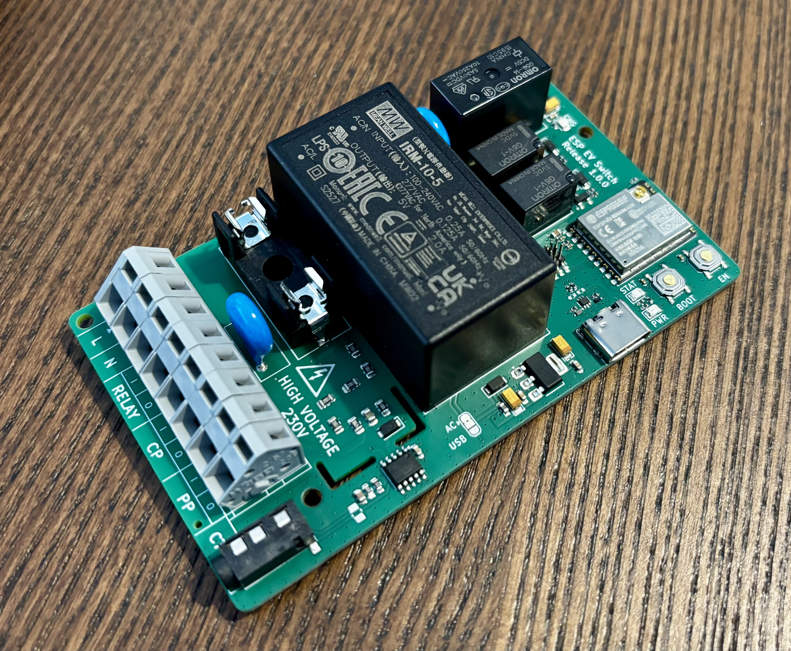
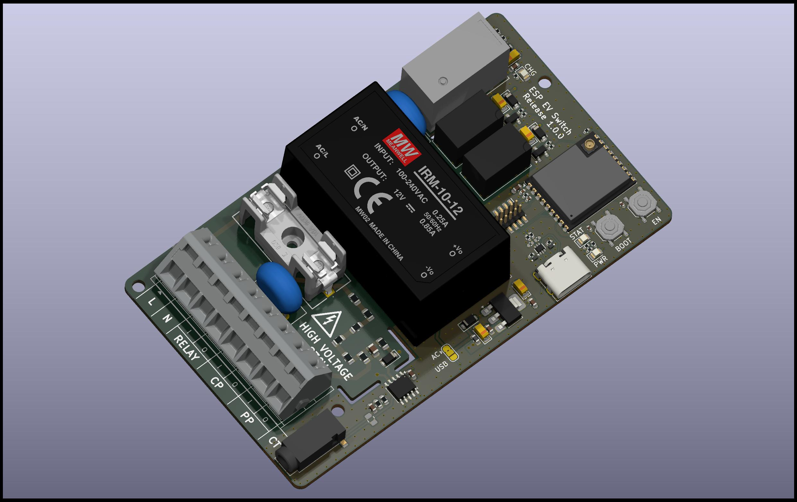
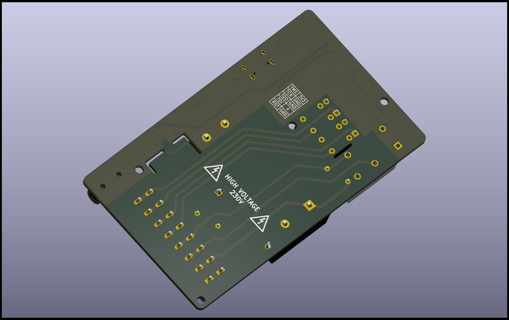
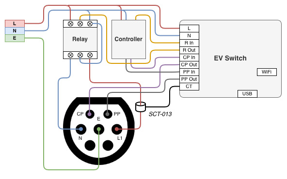

# ESP Electric Vehicle charge controller

The purpose of this project is to control a EVSE (Electric Vehicle Supply
Equipment), aka. "wall-box", to charge an electric vehicle. It will open/close
the Proximity Pilot (PP), the Control Pilot (CP) and the AC coil for the main
power. This project will not managed the EV protocol and be integrated only as a
switch between the vehicle and the EVSE. The control will be done with Home
Assistant by using [ESPHome](https://esphome.io) firmware.

Custom software could be written by using ESP-IDF SDK but it is not the purpose
of this project.



## Signals description

**Proximity Pilot**, also known as "Plug Present", is used to signal the
connection / disconnection of the plug. It can be used to simulate a manual
disconnection by opening the circuit as the "release" button.

**Control Pilot** is used to negotiate the charge and exchange information by
the vehicle and the EVSE. In case of proximity pilot is not detected, the signal
can be opened to trigger an error on the charge controller.

**AC coil** is used to open/close the main power relay. In case of power is still
remaining after PP and CP are opened.

## Disclaimer

The authors and contributors of this repository disclaim any and all
responsibility for the misuse of the information, tools, or techniques described
herein. Users are strictly advised to utilize this information in accordance with
applicable laws and regulations and only on systems for which they have explicit
authorization.

Neither the authors nor contributors shall be held liable for any damages, direct
or indirect, resulting from the misuse or unauthorized application of the
knowledge contained herein.

These device is powered from 230V line. Every flash and debug steps shall be
take with extreme caution with main power supply disconnected or by using
an isolator on the USB connector !

## Hardware

Wago connector is used for easy plug with the different wall-box wires:

- `L`: Line (230V)
- `N`: Neutral
- `RELAY I/O`: EVSE main power supply coil control Input/Output
- `CP I/O`: EVSE Control Pilot Input/Output
- `PP I/O`: EVSE Proximity Pilot Input/Output

3.5mm jack is available for current transformer measure. It's compatible with the
sensor SCT-013-050. Different current limit could be selected depending of the
maximum voltage of your wall-box: for a 7kW charge, select at least a probe for
50 A.

Three status LED are available:

- `PWR`: 3.3V state
- `STAT`: System status controlled by software
- `CHG`: Charge indicator (all circuits are open/close)

Two buttons are available for ESP32 boot sequence:

- `BOOT`: Control processor download mode on boot
- `EN`: Control processor reset

For advanced debug, a 2x5 1.27 pins header connectors is available with the
Cortex-M JTAG/SWD pinout for external probe.




### Wiring

The board will be placed between the EVSE and the EV plug. It will open/close
the different signals to control the main power relay, the control signal and
the proximity signal.



Note: This wiring could be adapted for tri-phase system and should be able
to control the EVSE. The power measure can only be done on one phase.

### Components choice

This project is based on an ESP32-C3 module to simplify design and ensure good
WiFi performance (with external antenna connector). ESP32 has been selected for
the big community to generate software and the frameworks available. Espressif
hardware design rules has been take into account following there
[documentation](https://docs.espressif.com/projects/esp-hardware-design-guidelines/en/latest/esp32c3/pcb-layout-design.html)

For easy debug and flashing, ESP32 with USB-CDC and JTAG support has been selected.

The 5V power rail is generated from a Mean Well AC-DC power supply. It has been
selected for the "ready to use" and the security / certification. The 5V is used
to power the relays.
The 3.3V power rail is generated from a LDO using the 5V power rail. It's used for
the controller part: ESP32, measure and signals.

By default, the 5V from the USB connector is not connected. For debug, it can
be forced with a jumper to solder on the PCB. In this case, do not connect / solder
both 5V USB & 5V AC-DC.

All others components has been selected from [JLCPCB](https://jlcpcb.com/parts/)
catalogue to minimize the cost and the assembly fees.

### Manufacturing

The board is manufactured by [JLCPCB](https://jlcpcb.com), here is the details
you will require to generate an order.

*Note: JLCPCB requests some modifications on output files, do not use direct
export from KiCad (check the FAQ)*

#### PCB

Files: [Gerbers](jlcpcb/gerbers.zip)

Configuration              | Value
---------------------------|---------------------------------
Base Materiel              | FR-4
Layers                     | 4
Dimensions                 | 99.92 x 58.42 mm
Different design           | 1
Delivery format            | Single PCB
PCB thickness              | 1.6
PCB color                  | Green (other colors have fees)
Silkscreen                 | White
Materiel type              | FR4-Standard TG 135-140
Surface finish             | HASL
Specify layer sequence     | F_Cu / In1_Cu / In2_Cu / B_Cu
Impedance control          | Yes
Layer stack-up             | JLC04161H-7628
Via covering               | Tented
Min via hole size/diameter | 0.3mm/0.45mm
Remove order number        | Specify a location

*Note: All options have not been detail here, keep default value.*

#### Assembly

Files: [BOM](jlcpcb/bom.csv), [CPL](jlcpcb/cpl.csv)

Configuration       | Value
--------------------|--------------------
PCBA type           | Economic
Assembly side       | Top

Verify "pick & place" orientations and positions on the web viewer

*Note: All options have not been detail here, keep default value.*

### Calibration

For power consumption measurement, a BL0942 chip is used and connected to the
current transformer probe. Default values are set for the voltage, current, power
and energy reference. The BL0942 is calibration free and default value could
work. If better accuracy is required, the default value can be changed by following
a calibration process:

1. Voltage reference can be adapted by measuring the input voltage with a multimeter,
2. Current can adapted by using a well known load: example 10 A,
3. When your voltage/current are correctly calibrated, the power can be computed
with `P = U * I`,

### ESP32 Pinout

For those who want to reuse this project, here is the ESP32 pinout to manage the
different input/output.

Name               | Pin  | Direction
-------------------|------|----------
Relay ON           | IO0  | Output
Control Pilot ON   | IO1  | Output
Charge LED         | IO2  | Output (strapping pin)
Proximity Pilot ON | IO3  | Output
System Status LED  | IO8  | Output (strapping pin)
BL0942 CF1         | IO10 | Input
BL0942 Tx          | RX   | Input
BL0942 Rx          | TX   | Output

## ESPHome configuration

Device must be setup via USB connection the first time to flash the customized
firmware with sensors/buttons configuration.

Once it has been configured successfully, you should fix the device IP on your
router for easier Home Assistant configuration.

Note: Installation can be bypassed if already done or you can use docker image.
Check [ESPHome documentation](https://esphome.io/guides/getting_started_command_line.html)
for more details.

### Installation

```shell
pip install esphome
# Ensure your user session has the correct permission for serial port.
sudo usermod -a -G dialout <USERNAME>
```

### Customize

Depending of your installation and network, a `secrets.yaml` file must be
create with your specific configuration.

```yaml
# secrets.yaml
wifi_ssid: MySSID
wifi_password: MyStrongPassphrase
wifi_fb_ssid: ATX Controller Fallback Hotspot
wifi_fb_password: StrongPassphrase
ota_password: MyOTAPassphrase
api_key: 32BytesBase64String
```

### Compile and flash

```shell
# Generate the firmware.
esphome compile esphome.yaml
# Flash the firmware to the ESP.
esphome run esphome.yaml
# Get logs.
esphome logs esphome.yaml
```
